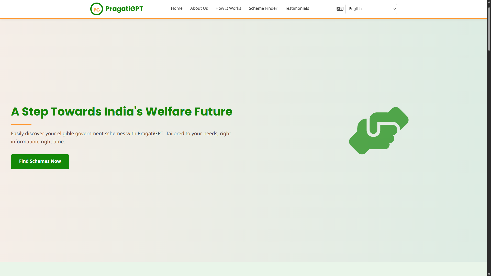
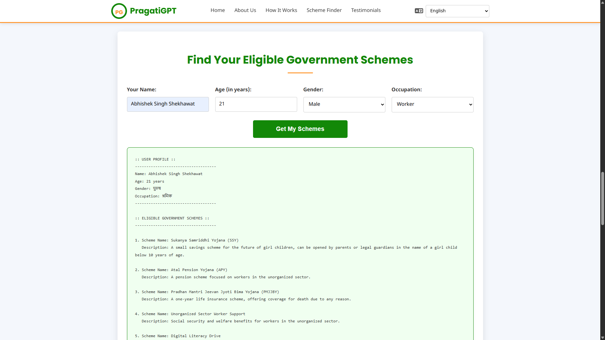

# PragatiGPT

A client-side Indian government scheme finder. Enter your profile, get matched schemes instantly — no backend, no API calls.

Live: [abhisheksinghshekhawatsde.github.io/PragatiGPT](https://abhisheksinghshekhawatsde.github.io/PragatiGPT)

---

## What It Does

You fill in your age, gender, and occupation. PragatiGPT matches you against a local dataset of government schemes and returns up to 6 relevant results with names and descriptions — in your selected language.

---

## Features

- Multilingual output (language switcher updates the full UI dynamically)
- Client-side scheme matching based on age, gender, and occupation
- Displays up to 6 results with a note if more matches exist
- Animated statistics counter on scroll via `IntersectionObserver`
- Loading indicator and smooth scroll to results on form submit

---

## Stack

| Layer | Technology |
|-------|------------|
| Frontend | HTML5, CSS3, Vanilla JS |
| Data | Local JS object (no backend) |
| Hosting | GitHub Pages |

---

## Screenshots

**Input Form**

**Results Output**

---

## Run Locally

git clone https://github.com/AbhishekSinghShekhawatSDE/PragatiGPT.git
cd PragatiGPT
open index.html

---

## Roadmap

- [ ] Load scheme data from an external JSON file
- [ ] Add state and income-level filters
- [ ] Expand scheme dataset with more nuanced eligibility criteria
- [ ] Add scheme search functionality
*   Improve accessibility (ARIA attributes, keyboard navigation).

